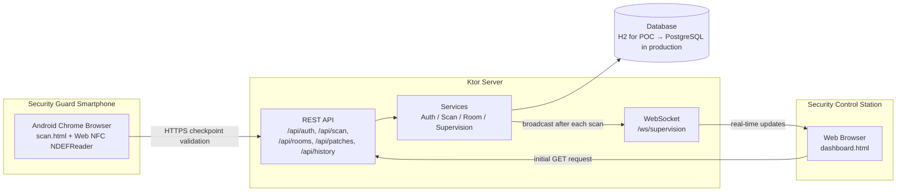

# Technical Architecture — NFC Security Patrols

## Overall Architecture



A single server hosts both the REST API and the WebSocket connection. This avoids deploying and monitoring additional components for a proof of concept or a single secured site.

The service-based structure, using `AuthService`, `ScanService`, `RoomService`, and `SupervisionHub`, also makes it possible to extract individual components into microservices later without rewriting the core business logic if usage or infrastructure requirements increase.

## Technology Choices

| Technology                                              | Reason for Choosing It                                                                                                                                                                                                                                                                                                                                                                                   | Rejected Alternative                                                                                                                                                                                                              |
| ------------------------------------------------------- | -------------------------------------------------------------------------------------------------------------------------------------------------------------------------------------------------------------------------------------------------------------------------------------------------------------------------------------------------------------------------------------------------------- | --------------------------------------------------------------------------------------------------------------------------------------------------------------------------------------------------------------------------------- |
| **Kotlin + Ktor**                                       | Native coroutines provide asynchronous WebSocket communication and database access without blocking operations. The JVM ecosystem is mature and offers strong monitoring, security, and testing libraries such as jBCrypt. Kotlin also creates consistency if the client later requires a native Android application, because the same language can be used for both the backend and mobile application. | Node.js with Express would be faster to set up, but its weaker default typing is less suitable for a system where data integrity and proof of checkpoint validation are essential.                                                |
| **Web NFC PWA instead of a native Android application** | No installation is required and no application updates need to be distributed manually. Security guards may use shared devices between shifts, so accessing the application through a URL simplifies deployment and maintenance. A bug fix can be deployed immediately for every device.                                                                                                                 | A native Android application would provide more advanced NFC capabilities, such as background scanning and NDEF writing, but its development and update cycle would be heavier and less suitable for a one-week proof of concept. |
| **Exposed + H2 file database for the POC**              | No separate database infrastructure is required for the demonstration. Migration to PostgreSQL mainly requires changing the JDBC connection configuration, while the Exposed DSL and most of the data-access logic remain unchanged.                                                                                                                                                                     | SQLite was not selected because PostgreSQL provides a more suitable long-term solution for concurrent writes, monitoring, backups, and multi-site deployment.                                                                     |
| **WebSocket for supervision**                           | The security control station receives updates automatically without refreshing the page. This avoids aggressive REST polling and provides almost immediate visibility when a checkpoint is validated during a patrol.                                                                                                                                                                                    | REST polling every few seconds would be simpler but would introduce visible delays and unnecessary server traffic across multiple secured sites.                                                                                  |
| **Opaque session token + bcrypt instead of JWT**        | Sessions can be revoked immediately when a guard logs out, an account is disabled, or access must be withdrawn. The token is checked against the `sessions` table on every request. A signed JWT could remain valid until its expiration time, even after the user account has been disabled.                                                                                                            | Stateless JWT authentication is easier to scale horizontally but provides less immediate control over session revocation for this physical-security use case.                                                                     |

## Data Model

```text
Rooms        (id, name, building, floor, orange_threshold_minutes, red_threshold_minutes)

Guards       (id, badge[unique], full_name, pin_hash, role, active,
              failed_attempts, locked_until)

Patches      (id, tag_uid[unique], room_id -> Rooms, active, damaged, created_at)

Scans        (id, patch_id -> Patches, room_id -> Rooms, guard_id -> Guards,
              scanned_at, received_at, offline_sync)

Sessions     (id, token[unique], guard_id -> Guards, created_at, expires_at)
```

In this model, `Rooms` represent the secured areas, zones, entrances, corridors, storage areas, technical rooms, or other locations where NFC checkpoints are installed.

### Main Design Decisions

* `Patches.room_id` is nullable because an NFC patch may be registered in the system before being assigned to a secured area or checkpoint.

* `Scans` stores `room_id` even though the room can already be obtained through `patch_id`. This intentional duplication preserves historical accuracy if an NFC patch is later reassigned to another checkpoint.

* `scanned_at` represents the time when the security guard scanned the checkpoint. This value may come from an offline device and may therefore be received later.

* `received_at` represents the time when the server received the scan. Keeping these two timestamps separate makes it possible to identify unusual delays and maintain traceability for offline synchronization.

* The alert thresholds, `orange_threshold_minutes` and `red_threshold_minutes`, are configured for each secured area instead of being global.

* Not every checkpoint has the same level of importance. For example, an entrance, emergency exit, restricted-access room, technical area, or storage zone may require more frequent checks than a low-risk corridor.

## Operational Use Case

A security guard is stationed at the entrance or security control point of a secured site.

During each patrol round, the guard walks through predefined areas and scans the NFC patch installed at every checkpoint.

Each scan records:

* the identity of the security guard;
* the checkpoint or secured area;
* the scan date and time;
* the time when the server received the scan;
* whether the scan was transmitted directly or synchronized after an offline period;
* the operational status of the NFC patch.

The security control station displays the current status of all checkpoints in real time.

The status can be represented as:

* **Green:** the checkpoint was validated within the expected time;
* **Orange:** the checkpoint has not been validated recently and requires attention;
* **Red:** the checkpoint has exceeded the maximum allowed delay, has never been scanned, or its NFC patch is reported as damaged.

This system provides evidence that the patrol was completed and allows supervisors to quickly detect missing, delayed, or suspicious checkpoint validations.

## Deployment and Scalability: From 1 Secured Site to 50 Sites

### Current Stage — POC for One Site

The proof of concept uses:

* one Ktor server process;
* a local H2 file database;
* manual deployment;
* one security control station;
* one or more Android smartphones with NFC support;
* several NFC checkpoints installed throughout the secured premises.

This configuration is sufficient to demonstrate authentication, NFC scanning, offline storage, scan history, administration, and real-time supervision.

### Stage 1 — Real Pilot Site

For deployment on a real secured site:

* replace H2 with managed PostgreSQL;
* enable HTTPS using an internal certificate or a reverse proxy such as Caddy or Nginx;
* configure automated database backups;
* centralize application logs;
* add monitoring for server availability and WebSocket connections;
* define a secure process for creating, replacing, and deactivating NFC patches.

The migration to PostgreSQL requires limited changes because the application already uses the Exposed data-access layer.

### Stage 2 — Multi-Site Deployment for 5 to 10 Sites

A centralized backend can support several secured sites.

Each site would have its own:

* security guards;
* checkpoints;
* NFC patches;
* alert thresholds;
* scan history;
* access permissions.

A `site_id` field would be added to the relevant entities to isolate data between sites.

The supervision dashboard could then provide:

* a view for one specific secured site;
* a multi-site overview for regional security management;
* filters by site, building, floor, zone, guard, or alert status;
* centralized monitoring from a main security control station.

### Stage 3 — Large Deployment for 50 Sites

For approximately 50 secured sites, the system could move to a horizontally scalable architecture.

Several stateless Ktor instances would run behind a load balancer.

Because sessions are stored in the database instead of local server memory, a request can be handled by any available server instance without disconnecting the user.

WebSocket events would require communication between server instances. Redis Pub/Sub or an equivalent message broker could be introduced so that a scan processed by server instance A is also sent to a supervision dashboard connected to server instance B.

Static pages such as `scan.html`, `dashboard.html`, `history.html`, and `enroll.html` could be delivered through a CDN or edge server. This would reduce the load on the application server and improve loading times across geographically distributed secured sites.

At this stage, the architecture could include:

* multiple Ktor backend instances;
* a load balancer;
* managed PostgreSQL with replication and automated backups;
* Redis Pub/Sub for real-time event distribution;
* centralized logging and monitoring;
* a CDN for static application files;
* site-level access isolation;
* role-based administration;
* disaster-recovery and service-continuity procedures.
